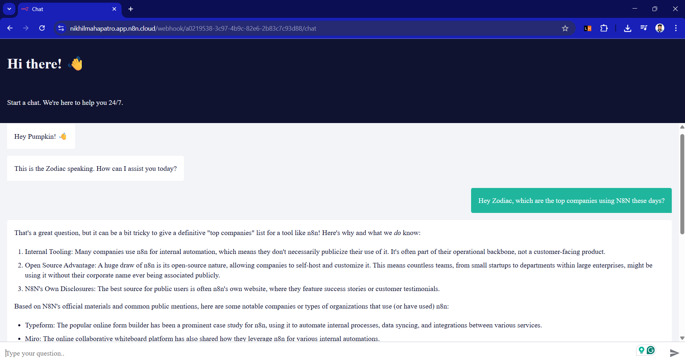

# N8N ChatBot (Gemini AI)

A chatbot flow for [n8n](https://n8n.io) powered by Gemini Pro (Google AI), with context memory and user interaction logging.

> Runs entirely in your local n8n instance using HTTP Webhook triggers and Google Gemini via API key.

---

### What it does

- Handles chat interactions with Google Gemini (Pro) via API
- Uses a webhook trigger to receive user input
- Maintains memory using context variables
- Logs conversations with timestamp and session info
- Visual walkthrough provided (15 step-by-step screenshots)

---

### Demo

---

### Sample Output

> You: Hey, what’s the weather in Delhi?  
> Bot: The current weather in Delhi is 37°C and sunny. Would you like a 3-day forecast?

